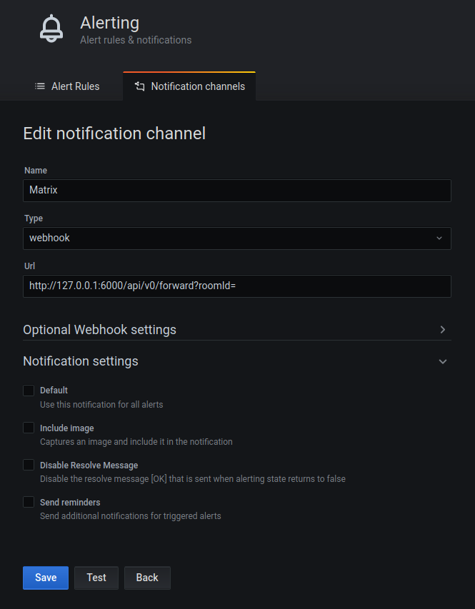
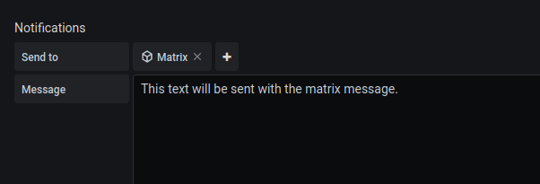

# Grafana to Matrix Forwarder

Forward alerts from [Grafana](https://grafana.com) to a [Matrix](https://matrix.org) chat room.

 [](https://gitlab.com/hectorjsmith/grafana-matrix-forwarder/-/commits/main) [](https://goreportcard.com/report/gitlab.com/hectorjsmith/grafana-matrix-forwarder)

---

This project provides a simple way to forward alerts generated by Grafana to a Matrix chat room.

Define a Grafana webhook alert channel that targets an instance of this application.
This tool will convert the incoming webhook to a Matrix message and send it on to a specific chat room.


## Table of Contents
1. Features
2. How to use
3. Docker
    1. Environment variables
    2. Docker run
    3. Docker compose
4. CLI usage
5. Metrics

## 1. Features

  * 📦 **Portable**
    * As a single binary the tool is easy to run in any environment
  * 📎 **Simple**
    * No config files, all required parameters provided on startup
  * 🪁 **Flexible**
    * Support multiple grafana alert channels to multiple matrix rooms
  * 📈 **Monitorable**
    * Export metrics to track successful and failed forwards

## 2. How to use

**Step 1**

Run the forwarder by providing a matrix account to send messages from.

```
$ ./grafana-matrix-forwarder --user @userId:matrix.org --password xxx --homeserver matrix.org
```

**Step 2**

Add a new **POST webhook** alert channel with the following target URL: `http://<ip address>:6000/api/v0/forward?roomId=<roomId>`

*Replace with the server ID and matrix room ID.*



**Step 3**

Setup alerts in grafana that are sent to the new alert channel.



## 3. Docker

An official docker image is available on the Gitlab container registry.
Use it by pulling the following image:

```
registry.gitlab.com/hectorjsmith/grafana-matrix-forwarder:latest
```

Use the `:latest` tag to get the most up to date code (less stable) or use one of the version tagged images to use a specific release.
See the [registry page](https://gitlab.com/hectorjsmith/grafana-matrix-forwarder/container_registry/1616723) for all available tags.

### 3.1. Environment Variables

The following environment variables should be set to configure how the forwarder container runs.
These environment variables map directly to the CLI parameters of the application.

- `GMF_MATRIX_USER` (required) - Username used to login to matrix
- `GMF_MATRIX_PASSWORD` (required) - Password used to login to matrix
- `GMF_MATRIX_HOMESERVER` (required) - URL of the matrix homeserver to connect to
- `GMF_SERVER_HOST` (optional) - Host address the server connects to (defaults to "0.0.0.0")
- `GMF_SERVER_PORT` (optional) - Port to run the webserver on (default 6000)
- `GMF_RESOLVE_MODE` (optional) - Set how to handle resolved alerts - valid options are: 'message', 'reaction', and 'reply'
- `GMF_LOG_PAYLOAD` (optional) - Set to any value to print the contents of every alert request received from grafana (disabled if set to "no" or "false")

### 3.2. Docker run

Use the following command to run the forwarder as a docker container.

```
docker run -d \
    --name "grafana-matrix-forwarder" \
    -e GMF_MATRIX_USER=@user:matrix.org \
    -e GMF_MATRIX_PASSWORD=password \
    -e GMF_MATRIX_HOMESERVER=matrix.org \
    registry.gitlab.com/hectorjsmith/grafana-matrix-forwarder:latest
```

### 3.3. Docker compose

The following is a simple docker-compose file to run the forwarder.

```
version: "2"
services:
  forwarder:
    image: registry.gitlab.com/hectorjsmith/grafana-matrix-forwarder:latest
    environment:
    - GMF_MATRIX_USER=@user:matrix.org
    - GMF_MATRIX_PASSWORD=password
    - GMF_MATRIX_HOMESERVER=matrix.org
    ports:
    - "6000:6000"
```

## 4. CLI usage

```
$ grafana-matrix-forwarder -h

  -env
        ignore all other flags and read all configuration from environment variables
  -homeserver string
        url of the homeserver to connect to (default "matrix.org")
  -host string
        host address the server connects to (default "0.0.0.0")
  -logPayload
        print the contents of every alert request received from grafana
  -password string
        password used to login to matrix
  -port int
        port to run the webserver on (default 6000)
  -resolveMode string
        set how to handle resolved alerts - valid options are: 'message', 'reaction', 'reply' (default "message")
  -user string
        username used to login to matrix
  -version
        show version info and exit
``` 

## 5. Metrics

Access exported metrics at `/metrics` (on the same port). Metrics are compatible with prometheus.

**Note:** All metric names include the `gmf_` prefix (grafana matrix forwarder) to make sure they are unique and make them easier to find.

Exposed metrics:
  * `up` - Returns 1 if the service is up
  * Forward counts
    * `total` - total number of alerts forwarded
    * `success` - number of alerts successfully forwarded
    * `error` - number of alerts where the forwarding process failed (check logs for error details)
  * Alert counts by state
    * `total` - total number of alerts received
    * `alerting` - alert count in the *alerting* state
    * `no_data` - alert count in the *no_data* state
    * `ok` - alert count in the *ok* state (resolved alerts)
    * `other` - number of received alerts that have an unknown state (check logs for details)

**Sample**

```
# HELP gmf_up
# TYPE gmf_up gauge
gmf_up 1
# HELP gmf_forwards
# TYPE gmf_forwards gauge
gmf_forwards{result="error"} 1
gmf_forwards{result="success"} 5
gmf_forwards{result="total"} 6
# HELP gmf_alerts
# TYPE gmf_alerts gauge
gmf_alerts{state="alerting"} 1
gmf_alerts{state="no_data"} 1
gmf_alerts{state="ok"} 2
gmf_alerts{state="other"} 1
gmf_alerts{state="total"} 6
```

## Thanks

Made possible by the [maunium.net/go/mautrix](https://maunium.net/go/mautrix/) library and all the contributors to the [matrix.org](https://matrix.org) protocol.
